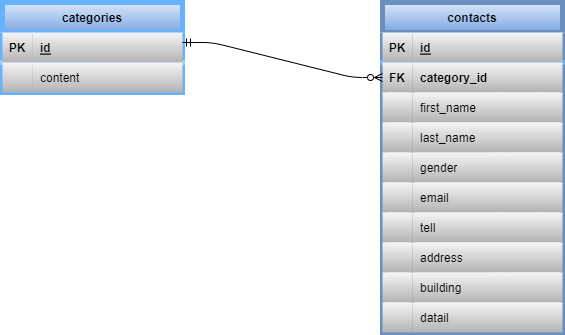

# Inquiry_form

## 環境構築

### 1 Gitファイルをクローンする

git clone git@github.com:basstuba/inquiry_form.git

### 2 Dockerコンテナを作成する

docker-compose up -d --build

### 3 Laravelパッケージをインストールする

docker-compose exec php bash

でPHPコンテナにログインし

composer install

### 4 .envファイルを作成する

PHPコンテナにログインした状態で

cp .env.example .env

作成した.envファイルの該当欄を下記のように変更

DB_HOST=mysql

DB_DATABASE=laravel_db

DB_USERNAME=laravel_user

DB_PASSWORD=laravel_pass

### 5 テーブルの作成

docker-compose exec php bash

でPHPコンテナにログインし(ログインしたままであれば上記コマンドは実行しなくて良いです。)

php artisan migrate

### 6 ダミーデータ作成

**ダミーデータについて**

**DatabaseSeeder.phpにcategoriesテーブルのseederファイルとcontactsテーブルのfactoryファイルの登録用コードが記述してあります。現在factoryファイルのコードを"//"で伏せてありますのでfactoryファイルの登録コードを使用する際には"//"を消して使用してください。**

PHPコンテナにログインした状態で

php artisan db:seed

### 7 アプリケーション起動キーの作成

PHPコンテナにログインした状態で

php artisan key:generate

## 使用技術

・PHP 7.4.9

・laravel 8.75

・MySQL 8.0.26

・nginx 1.21.1

・Livewire

・LaravelExcel

## ER図

## URL

・開発環境: http://localhost/

・phpMyAdmin: http://localhost:8080/

